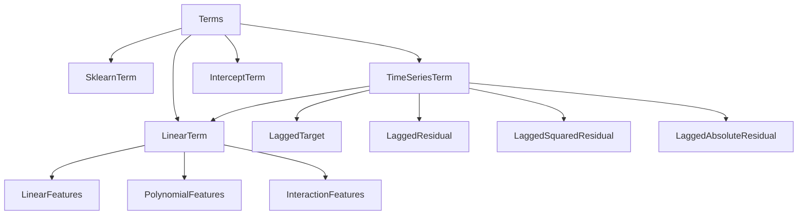

# Terms and feature transformations

We have terms that are fitted additively.
However, fitting terms sequentially can lead to suboptimal results.
To address this, we implement terms that take a number of feature transformations as input.
These transformations can be applied to the features before fitting the term.
So that we have a joint estimation on a large design matrix.

Therefore the differentation between terms and feature transformations is important. 

`Terms` provide
- estimation methods (fit, predict, etc)
- regularization methods (penalization, constraints, etc)
- model selection methods (cross-validation, information criteria, etc)

`FeatureTransformations` provide
- the creation of design matrices from raw features
- some attributes? (number of lags, size of the design matrix, etc)

This might then look like this:

```python
ts_term = TimeSeriesTerm(
    effects=[
        LaggedTarget(lags=[1,2,3]),
        LaggedResidual(lags=[1,2,3]),
    ],
    fit_intercept=True,
    estimation="ols",
)
```

but terms should not need to take feature effects. Some terms might not need feature transformations at all, e.g., an intercept term or a simple linear term. This places the burden of checking whether the feature transformations could be estimated jointly on the user. For some terms, we could provide sensible defaults. We could also provide some checks that allow the user to verify whether their design matrix is well-posed or whether there are some terms that could be estimated jointly.

The following diagram shows the relationship between terms and feature transformations.



Terms are defined by _JOINT ESTIMATION_ on a design matrix that is created by applying feature transformations to raw features. This is important e.g. for smoothing or regularization across different feature transformations.

Terms should always _increase_ the amount of information that is used to create the design matrix. A timeseries term should be able to also take linear features as input, for example. 

Some terms are special, such as the `SklearnTerm`, which can take any sklearn-compatible `Estimator` or `Pipeline` as input and will fit this, or the intercept which does not need any feature transformations at all. 


