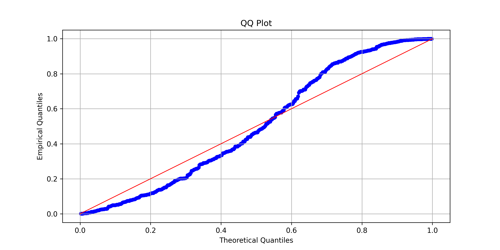

# Model diagnostics

We provide several diagnostic plots to assess the fit of distributional regression models. These include the Probability Integral Transform (PIT) histogram, Q-Q plot, and worm plot. 

Model diagnostics in `ondil` follow the `scikit-learn` convention of [`Displays`](https://scikit-learn.org/stable/auto_examples/miscellaneous/plot_display_object_visualization.html) and can be created using the `from_estimator` class method of the respective display classes.

The whole code for generating the figures is provided in the file [`examples/diagnostics.py`](https://github.com/simon-hirsch/ondil/blob/main/examples/diagnostic_tools.py) in the examples folder.

## Probability Integral Transform (PIT) Histogram

We can assess the calibration of our additive models using the Probability Integral Transform (PIT) histogram. The PIT is computed by evaluating the cumulative distribution function (CDF) of the fitted model at the observed data points. If the model is well-calibrated, the PIT values should be uniformly distributed.

As a preparation, we fit a distributional regression model to the diabetes dataset:

```python
import matplotlib.pyplot as plt
from sklearn.datasets import load_diabetes

from ondil.diagnostics import PITHistogramDisplay, QQDisplay, WormPlotDisplay
from ondil.distributions import Normal
from ondil.estimators import OnlineDistributionalRegression

## Diabetes data set
X, y = load_diabetes(return_X_y=True)

## Simple linear regression with OLS
# We use all variables to model both mu and keep sigma as constant (intercept)
# Can also use: "intercept" or pass a numpy array with indices / boolean
equation = {
    0: "all",
    1: "intercept",
}

model = OnlineDistributionalRegression(
    distribution=Normal(),
    method="ols",
    equation=equation,
    fit_intercept=True,
)
model.fit(X, y)
```

Now we can create the PIT histogram:

````python
PITHistogramDisplay.from_estimator(
    estimator=model,
    X=X,
    y=y,
)
````


/// caption
PIT histogram for the diabetes dataset using a simple linear regression model with normal distribution.
///


## Q-Q Plot

The QQ-plot shows the quantiles of the observed data against the quantiles of the fitted distribution. If the model fits well, the points should lie approximately along the 45-degree line.

We can create a QQ-plot as follows:

````python
QQDisplay.from_estimator(
    estimator=model,
    X=X,
    y=y,
)
````


/// caption
QQ plot for the diabetes dataset using a simple linear regression model with normal distribution.
///

## Worm Plot

The worm plot is a detrended version of the QQ-plot. It plots the differences between the observed and expected quantiles against the expected quantiles. This plot helps to identify specific areas where the model may not fit well.

We can create a worm plot as follows:

```python
WormPlotDisplay.from_estimator(
    estimator=model, 
    X=X,
    y=y,
)
```


/// caption
Worm plot (detrended QQ-plot) for the diabetes dataset using a simple linear regression model with normal distribution.
///