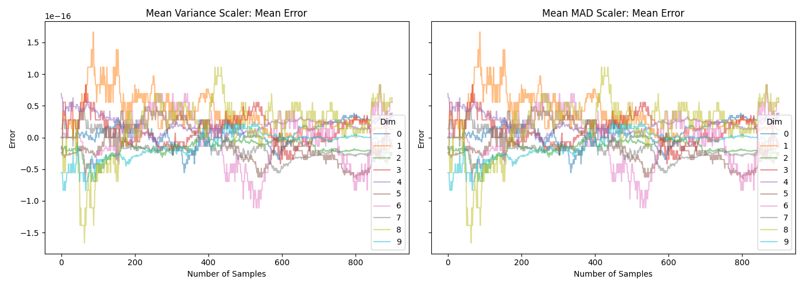
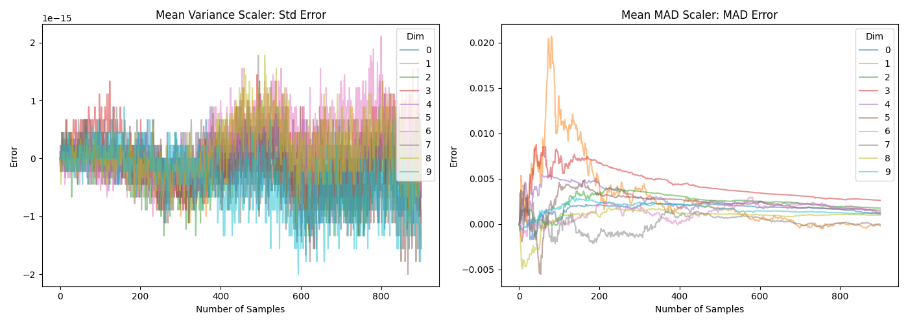

# Online Scaling and Preprocessing

## Feature Scaling: Mean-STD vs. Mean-MAD

This module provides two normalization strategies with different assumptions
about the data distribution and sensitivity to outliers.

### Mean-STD Scaling

Transforms each feature as: `z = (x - mean) / std` and hence

- Centers data around `0` using the arithmetic mean.
- Scales to unit variance using standard deviation.
- Works best when features are approximately Gaussian and outliers are limited.
- Sensitive to extreme values, since both `mean` and `std` are strongly affected by them.

### Mean-MAD

Transforms each feature as: `zt = (x - mean) / MAD` where:

- `MAD = mean(|x - mean|)` is the mean absolute deviation from the mean.
- Reduces the influence of outliers compared to standard deviation-based scaling.
- Better for heavy-tailed, skewed, or contaminated datasets.
- May be less efficient than mean-STD scaling on normal data
- Does not track _exactly_ online, but only approximately (see below)

### Choosing between them

- Use `OnlineScaler`for well-behaved, near-normal features and models that assume standardized Gaussian-like inputs.
- Use `OnlineMeanAbsoluteDeviationScaler` when outliers are common or feature distributions are non-Gaussian and you want more stable scaling factors.

### Online Tracking Behaviour

The mean can be tracked online exactly through a simple recursion formula.

Based on this and Welford's formula (see e.g. [here](https://ieeexplore.ieee.org/abstract/document/9387973)), the variance and weighted variances can be tracked exactly. The variance is defined as:
$$\text{Var}_n = \frac{1}{n} \sum_{i=1}^{n} (x_i - \mu_n)^2$$
and the following key identity allows online update:
$$\sum_{i=1}^{n} (x_i - \mu_n)^2 = \sum_{i=1}^{n-1} (x_i - \mu_{n-1})^2 + n(\mu_n - \mu_{n-1})^2$$
However, for the mean absolute deviation from the mean, no such closed-form $\mathcal{O}(1)$ update exists. 

The reason for this is explained in the following quick example. The true MAD after $n$ updates is defined as:
$$\text{MAD}_n = \frac{1}{n} \sum_{i=1}^{n} |x_i - \mu_n| \quad \text{where} \quad \mu_n = \frac{1}{n} \sum_{i=1}^{n} x_i$$
But online tracking gives you:
$$\text{MAD}_{\text{online}} = \frac{1}{n} \sum_{i=1}^{n} |x_i - \mu_i| \quad \text{where} \quad \mu_i = \text{mean after } i \text{ points}$$
Where each $x_i$ is measured against a *different* mean ($\mu_i$ instead of $\mu_n$).
and there is no:
$$\sum_{i=1}^{n} |x_i - \mu_n| \neq \sum_{i=1}^{n-1} |x_i - \mu_{n-1}| + [\text{simple update term}]$$
The absolute value prevents algebraic simplification. We cannot incrementally update MAD when the mean changes without revisiting all previous points.

The difference can also be seen in the following two plots. Note that the $y$-axis in the lower plot is _very_ different.





Which can be generated with the following script:

```python
import numpy as np
import scipy.stats as stats
import matplotlib.pyplot as plt
from ondil.scaler import (
    OnlineMeanAbsoluteDeviationScaler,
    OnlineScaler,
)

INIT_SIZE = 100
SIZE = 1000
DIMS = 10
SEED = 42

rng = np.random.default_rng(SEED)

mean_var = OnlineScaler()
mean_mad = OnlineMeanAbsoluteDeviationScaler()

X = rng.standard_normal(size=(SIZE, DIMS))
w = rng.uniform(0.1, 1.0, SIZE)

true_mean = np.zeros((SIZE - INIT_SIZE + 1, DIMS))
pred_mean = np.zeros((SIZE - INIT_SIZE + 1, 2, DIMS))

true_dispersion = np.zeros((SIZE - INIT_SIZE + 1, 2, DIMS))
pred_dispersion = np.zeros((SIZE - INIT_SIZE + 1, 2, DIMS))

for i, t in enumerate(range(INIT_SIZE, SIZE + 1)):
    if i == 0:
        mean_var.fit(X[:t], sample_weight=w[:t])
        mean_mad.fit(X[:t], sample_weight=w[:t])
    else:
        mean_var.update(X[t - 1 : t], sample_weight=w[t - 1 : t])
        mean_mad.update(X[t - 1 : t], sample_weight=w[t - 1 : t])

    true_mean[t - INIT_SIZE, :] = np.average(X[:t], axis=0, weights=w[:t])
    pred_mean[t - INIT_SIZE, 0, :] = mean_var.mean_
    pred_mean[t - INIT_SIZE, 1, :] = mean_mad.mean_

    true_dispersion[t - INIT_SIZE, 0, :] = (
        np.average((X[:t] - true_mean[t - INIT_SIZE, :]) ** 2, axis=0, weights=w[:t])
        ** 0.5
    )
    true_dispersion[t - INIT_SIZE, 1, :] = np.average(
        np.abs(X[:t] - true_mean[t - INIT_SIZE, :]), axis=0, weights=w[:t]
    )
    pred_dispersion[t - INIT_SIZE, 0, :] = mean_var.dispersion_
    pred_dispersion[t - INIT_SIZE, 1, :] = mean_mad.dispersion_

# %%
titles = ["Mean Variance Scaler: Mean Error", "Mean MAD Scaler: Mean Error"]
fig, axes = plt.subplots(1, 2, figsize=(14, 5), sharex=True, sharey=True)
for i in range(2):
    axes[i].plot(
        true_mean - pred_mean[:, i, :],
        alpha=0.5,
        label=range(DIMS),
    )
    axes[i].set_title(titles[i])
    axes[i].set_xlabel("Number of Samples")
    axes[i].set_ylabel("Error")
    axes[i].legend(title="Dim")
plt.tight_layout()
plt.show(block=False)

# %%
fig, axes = plt.subplots(1, 2, figsize=(14, 5), sharex=True, sharey=False)
titles = ["Mean Variance Scaler: Std Error", "Mean MAD Scaler: MAD Error"]

for i in range(2):
    axes[i].plot(
        true_dispersion[:, i, :] - pred_dispersion[:, i, :],
        alpha=0.5,
        label=range(DIMS),
    )
    axes[i].set_title(titles[i])
    axes[i].set_xlabel("Number of Samples")
    axes[i].set_ylabel("Error")
    axes[i].legend(title="Dim")
plt.tight_layout()
plt.show(block=False)
```

## API Reference

::: ondil.scaler.OnlineScaler

::: ondil.scaler.OnlineMeanAbsoluteDeviationScaler
